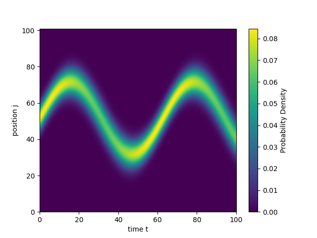

# Note for hw1

**本文件夹包含以下内容：**

- BitOperation.py：存储课上介绍的比特操作函数，在task1、task2中部分用到
- task1.py：完成task1的源代码
- task2.py：完成task2的源代码
- note.md：介绍源代码以及主要思路
- 2021010167_何铭鑫_hw1_task2_Q3.png：task2中第三问的图片

## task1

### Basic Principle: U(1) symmetry

该体系的哈密顿量有如下形式：
$$
H = -t \sum_{\{i,j\},\sigma} \left( C^\dagger_{i,\sigma} C_{j,\sigma} + C^\dagger_{j,\sigma} C_{i,\sigma} \right) + U \sum_i n_{i,\uparrow} n_{i,\downarrow} - V \sum_{\{\{i,j\}\}} \left( n_{i,\uparrow} + n_{i,\downarrow} \right) \left( n_{j,\uparrow} + n_{j,\downarrow} \right) - \mu \sum_{i,\sigma} n_{i,\sigma}
$$

显然只有hopping项会改变自旋的构型，其余项都由$n_{i,\sigma}$构成，并不会带来非对角项。

记$N_{\uparrow},N_{\downarrow}$分别为体系的自旋向上和自旋向下的总粒子个数，取值范围是$N_{\uparrow},N_{\downarrow}\in[0,6],N_{\uparrow},N_{\downarrow}\in\mathbb{N}$。由于hopping项总是由一个产生算符和一个湮灭算符构成，因而它不会改变$N_{\uparrow},N_{\downarrow}$的值。那么我们可以根据$N_{\uparrow},N_{\downarrow}$的值进行子空间的划分。总共可以分为$7\times7=49$个子空间。

不过$N_{\uparrow}=N_{\downarrow}=0$以及$N_{\uparrow}=N_{\downarrow}=6$对应的子空间维数都是$1$，同时hopping项作用到这两个子空间的基矢量上都将会直接得出$0$的结果。

### Source Code:

数据存储格式以及其相应的物理含义在源代码中均有注释给出，在此不再赘述。这里给出源代码的大致框架：

1. 相应参数以及近邻、次近邻格点信息的设置。
2. 划分子空间并且对子空间内的基矢重新标号。
3. 存储非零的哈密顿量矩阵元信息，分为对角项和非对角项(hopping项)，不过源代码中并没有将产生、湮灭算符设计为函数，而是直接在循环中进行翻转比特、存储正负号信息的操作。
4. 将哈密顿量在子空间中分块对角化并且寻找基态以及相应子空间信息。
5. 完成task1的三个问题，前两个问题较为直接。在最后一个问题中，由于分块对角化之后得到的基态是在子空间中的一个矢量，我们需要将该子空间中的基矢量映射回到总的希尔伯特空间中，这里就需要用到relabeled_subspaces中存储的信息(具体在源代码注释中提及)。

### Output

对于题设参数$t=1.0,U=6.0,V=0.3,\mu=3.0$，我的答案如下：

```
Q1: 6 smallest eigenvalues of the subspace (2, 4): [-21.50090616 -20.91569332 -20.78408639 -20.70114485 -20.47495955
 -20.42445133]
Q2: 20 smallest eigenvalues: [-21.500906159279907, -21.500906159279904, -21.500906159279904, -21.226026929230546, -21.121129849935162, -21.051335633265218, -20.915693317787674, -20.91569331778767, -20.91569331778766, -20.78408639063541, -20.78408639063541, -20.784086390635405, -20.70114485451338, -20.701144854513377, -20.701144854513366, -20.701144854513366, -20.701144854513355, -20.474959552370617, -20.474959552370613, -20.47495955237061]
Q3: There is only one ground state.
For ground state 1: 
Density of spin-up electrons: [0.16468682212616662, 0.14635625753733028, 0.6889569203365032, 0.6889569203365029, 0.14635625753733048, 0.16468682212616706]
Density of spin-down electrons: [0.8342252219408338, 0.8607268355069193, 0.3050479425522484, 0.305047942552249, 0.8607268355069188, 0.8342252219408332]
```

并没有发现群里讨论的简并的情况。

但是对于示例参数$t=1.0,U=4.0,V=0.4,\mu=4.0$，我的答案如下：

```
Q1: 6 smallest eigenvalues of the subspace (2, 4): [-28.67936709 -27.98163948 -27.72381461 -27.67289875 -27.44890693
 -27.29188288]
Q2: 20 smallest eigenvalues: [-32.41859496473454, -32.281864069929725, -32.281864069929696, -31.910945138192478, -31.910945138192446, -31.910945138192446, -31.71607071123746, -31.55970845398217, -31.55970845398217, -31.55155055920246, -31.551550559202454, -31.34812256689876, -31.348122566898756, -31.348122566898756, -31.24598689878245, -31.245986898782448, -31.100207006322588, 
-31.060153026160407, -31.060153026160368, -31.060153026160368]
Q3: There is only one ground state.
For ground state 1: 
Density of spin-up electrons: [0.909257821452714, 0.8639701440402184, 0.7267720345070641, 0.7267720345070698, 0.8639701440402179, 0.9092578214527157]
Density of spin-down electrons: [0.9092578214527169, 0.8639701440402184, 0.7267720345070706, 0.7267720345070641, 0.8639701440402192, 0.9092578214527107]
```

这与示例输出完全符合，因而我猜测是浮点数的位数导致我在使用题目中设计的参数进行计算之后没有发现群里讨论的简并的情况。

## task2

### Basic Principle:

本题较为简单，在此仅对基本思路进行介绍。首先将$t=0$时刻的波函数分解为各个本征态的叠加，然后利用各个本征态满足的Time Independent Shordinger Equation解出各个叠加系数的时间演化情况即可。

### Source Code:

1. 参数设置。
2. 写出哈密顿量并将其对角化找出本征态与本征值。
3. 将$t=0$的波函数进行分解，计算叠加系数的时间演化，组合出任意时刻的波函数。
4. 完成task2的三个问题，最后一个问题中的图片文件命名为`2021010167_何铭鑫_hw1_task2_Q3.png`。

### Output

对于题设参数$N=101,F=0.1,k_0=\pi/2,\alpha=0.15,N_0=51$，我的答案如下：

```
Q1: Lowest 10 eigenvalues:[-1.50050978 -1.13263731 -0.83544214 -0.57592755 -0.34141332 -0.12533996 0.07623401  0.26590362  0.44548515  0.61630546]
Q2: The probability density at t=42 and j=10,20,30,40,50:
|\psi(10, 42)|^2 = 1.1525756287265844e-05
|\psi(20, 42)|^2 = 0.0038162120695663672
|\psi(30, 42)|^2 = 0.057235477617943405
|\psi(40, 42)|^2 = 0.03756071696657235
|\psi(50, 42)|^2 = 0.0011379592224547378
```

第三问的图片如下：

