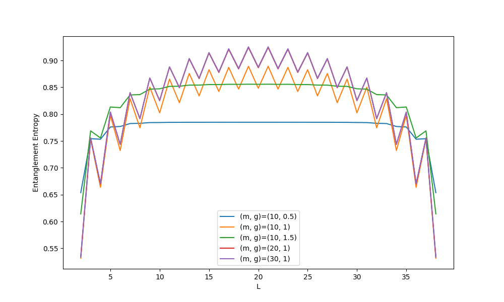
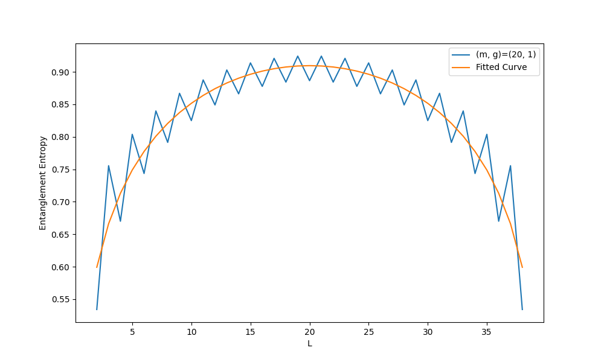

# Note for hw3

**本文件夹包含以下内容：**

- finite_dmrg_xx_yy_couple_spin_chain.py: 完成homework的源代码
- note.md：介绍源代码以及主要思路
- entanglement_entropy.png: hw3中第二问绘制的纠缠熵函数图像
- entanglement_entropy_fitted.png: hw3中第三问绘制的函数图像（包括拟合函数）

## Homework

### Source Code:

本题的source code主要根据课上给的github库中的[DMRG示例代码](https://github.com/simple-dmrg/simple-dmrg)中的`simple_dmrg_02_finite_system.py`进行了如下调整：

1. 修改哈密顿量的形式，在函数`H2`中引入了一个新的参数g，用于描述题给模型。
2. 在函数`single_dmrg_step`中引入了计算纠缠熵的算法并且将纠缠熵作为该函数的一个返回值。
```
entanglement_entropy = sum([-x * np.log(x) for x in evals if x > 1e-15])
```
3. 在函数`finite_system_algorithm`中设置`sweep_num`以及`sweep_round`参数，重复扫描几次以给出较好的结果。同时设置`delta_energy_per_site`参数来分辨是否已经达到较好的收敛结果，并且为了后续题目的完成，该函数中的中间变量`EE_list`将返回给定某个m和g之后的纠缠熵列表。在函数的最后将返回一个存储纠缠熵的字典`EE_dict`，其key为`(N,m,g)`，value为纠缠熵列表。另外，`m_sweep_list`参数被修改为`m_sweep`（即每次调用该函数只计算一组g和m）。
4. 最后是完成作业的`main`部分，在源代码中给出了问题与代码对应的注释。

### 讨论

#### 遇到的困难

最重要的改正是关于transfermatrix，源代码在`single_dmrg_step`函数中设置了变换矩阵为：
```
transformation_matrix = np.zeros((sys_enl.basis_size, my_m), dtype="d", order="F")
```
但是因为我们的哈密顿量中含有Pauli-y算符，因此我们需要将变换矩阵的`dtype`修改为`"complex"`，同样的在构造哈密顿量时我们也需要作此调整。

#### 关于结果的讨论分析

结果中绘制出的纠缠图像为褶皱形状，我猜测基态应该是由一对一对的类似于singlet的pair组成，当L的分界线划在了一对pair内部（即划在了组成这对pair的两个site之间）时，纠缠就很大（因为singlet是最大纠缠态，这对类似于singlet的pair之间也有着很大的纠缠）；而当L的分界线划在了两对不同的pair之间时，纠缠并没有前者那么大。于是纠缠图像呈现褶皱状。


### Output

对于题设参数$N=40$，我的答案如下：

> **Question1:**
```
(N, m, g)=(40, 10, 0.5)
Energy: -41.60529186250128
L: [2, 3, 4, 5, 6, 7, 8, 9, 10, 11, 12, 13, 14, 15, 16, 17, 18, 19, 20, 21, 22, 23, 24, 25, 26, 27, 28, 29, 30, 31, 32, 33, 34, 35, 36, 37, 38]
EE: [0.6537070462713006, 0.7542520090553401, 0.7532194600045037, 0.7760252558928409, 0.7769394342143537, 0.7824463170644339, 0.7828653435691901, 0.7842200672930244, 0.7843573988415884, 0.7846933769619349, 0.7847330100817108, 0.7848169783205146, 0.7848274087730169, 0.7848487938059525, 0.7848510764248111, 0.7848568770557065, 0.784856921680654, 0.7848588031448385, 0.7848580366972395, 0.784858803144876, 0.7848569216807058, 0.7848568770557527, 0.7848510764248747, 0.7848487938060029, 0.7848274087730694, 0.7848169783205666, 0.7847330100817651, 0.7846933769619796, 0.7843573988416295, 0.7842200672930426, 0.782865343569215, 0.7824463170644373, 0.776939434214361, 0.77602525589284, 0.7532194600045021, 0.7542520090553413, 0.6537070462713006]
(N, m, g)=(40, 10, 1)
Energy: -50.20686896606666
L: [2, 3, 4, 5, 6, 7, 8, 9, 10, 11, 12, 13, 14, 15, 16, 17, 18, 19, 20, 21, 22, 23, 24, 25, 26, 27, 28, 29, 30, 31, 32, 33, 34, 35, 36, 37, 38]
EE: [0.5316040145849621, 0.7534109130099043, 0.6636205018505587, 0.79778714527249, 0.7321722538739167, 0.828634327745435, 0.7744685638372671, 0.8501690482420616, 0.8023858484822076, 0.8652472036902397, 0.8212672769579477, 0.8757042879234764, 0.833959731687033, 0.8827183900109213, 0.8421051216602569, 0.8870337090102767, 0.8466587105544958, 0.8890893295953203, 0.8481240349836745, 0.8890893296224149, 0.846658710436297, 0.8870337090544823, 0.8421051216561097, 0.8827183900545036, 0.8339597317327961, 0.8757042879566266, 0.821267277009259, 0.8652472037100385, 0.8023858485175775, 0.8501690482505386, 0.7744685638532913, 0.8286343277473123, 0.7321722538775755, 0.7977871452724695, 0.6636205018505585, 0.7534109130099064, 0.5316040145849621]
(N, m, g)=(40, 10, 1.5)
Energy: -65.54866696351601
L: [2, 3, 4, 5, 6, 7, 8, 9, 10, 11, 12, 13, 14, 15, 16, 17, 18, 19, 20, 21, 22, 23, 24, 25, 26, 27, 28, 29, 30, 31, 32, 33, 34, 35, 36, 37, 38]
EE: [0.6140864264556499, 0.7687900446334015, 0.7555813156176918, 0.813283344404854, 0.8119580095317792, 0.8357356854801409, 0.8363441071985365, 0.8465549643852928, 0.8471377831365565, 0.8516441989440238, 0.8519466124669436, 0.853997867156173, 0.8540877277541725, 0.8550683449483234, 0.8550300187450465, 0.8555384591322601, 0.855420023421533, 0.8557150624888434, 0.8555257703797323, 0.8557150625329109, 0.8554200234718237, 0.8555384591769218, 0.8550300187946993, 0.8550683449875607, 0.854087727799002, 0.8539978671859517, 0.8519466125033801, 0.851644198962435, 0.8471377831615698, 0.8465549643933892, 0.8363441072108831, 0.8357356854818858, 0.8119580095345353, 0.813283344404917, 0.7555813156176918, 0.7687900446334015, 0.6140864264556499]
(N, m, g)=(40, 20, 1)
Energy: -50.21548723289404
L: [2, 3, 4, 5, 6, 7, 8, 9, 10, 11, 12, 13, 14, 15, 16, 17, 18, 19, 20, 21, 22, 23, 24, 25, 26, 27, 28, 29, 30, 31, 32, 33, 34, 35, 36, 37, 38]
EE: [0.5340952199010685, 0.7554978835371823, 0.6700025891395317, 0.8038233199530531, 0.7435306410085947, 0.8398253785501076, 0.7914213273931099, 0.8670118397215953, 0.8249905599029537, 0.8875901112190474, 0.8490926146659095, 0.9029090973777214, 0.8661940071577456, 0.9138121670264329, 0.8776644747563339, 0.9208262127384517, 0.8842801664673255, 0.9242611897668074, 0.8864436992952289, 0.9242611938470604, 0.8842801707898091, 0.9208262159401917, 0.8776644776020204, 0.9138121689583462, 0.866194008600491, 0.9029090982606176, 0.8490926151913287, 0.8875901114974134, 0.8249905600112912, 0.8670118397599822, 0.7914213273799888, 0.8398253785266256, 0.7435306410087434, 0.8038233199530533, 0.6700025891395268, 0.7554978835371831, 0.5340952199010685]
(N, m, g)=(40, 30, 1)
Energy: -50.21559063551642
L: [2, 3, 4, 5, 6, 7, 8, 9, 10, 11, 12, 13, 14, 15, 16, 17, 18, 19, 20, 21, 22, 23, 24, 25, 26, 27, 28, 29, 30, 31, 32, 33, 34, 35, 36, 37, 38]
EE: [0.5341470033491212, 0.7555409353014115, 0.6701439125510124, 0.8039572779253408, 0.743795163784197, 0.8400953776984481, 0.7918318113900409, 0.8674484242281987, 0.8255622014046611, 0.8882054335986393, 0.8498252947989798, 0.9036968460413011, 0.8670723840069452, 0.9147478520444685, 0.8786588040708675, 0.9218698533014932, 0.8853490761185664, 0.925361693531185, 0.8875383284899361, 0.9253616938064029, 0.8853490763660091, 0.9218698534795731, 0.8786588042150215, 0.9147478521327247, 0.8670723840697036, 0.9036968460724855, 0.8498252948172291, 0.8882054336050753, 0.8255622014069146, 0.8674484242278926, 0.7918318113902529, 0.8400953776984827, 0.7437951637842066, 0.8039572779253422, 0.6701439125510159, 0.7555409353014086, 0.5341470033491212]
```
> **Question2:**


> **Question3:**

```
Fitted parameters: c = 1.0039325715398915, c_prime = 0.4838836716888434
```
