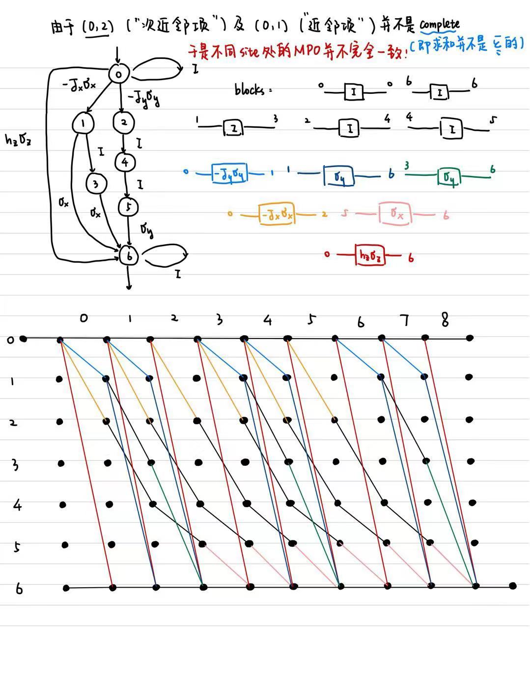

# Note for hw4

**本文件夹包含以下内容：**

- finite_automata.py: 完成homework的源代码
- note.md：介绍源代码以及主要思路
- compass_model_mpo.jpg: 绘制automata以及Q1图像

## Homework

### Source Code:

代码主要分为两个部分：第一部分为精确对角化方法构造哈密顿量，并计算最小的20个本征值；第二部分为使用MPO构造哈密顿量。

### Output

> Q1: write down the MPO for the compass model on a square lattice, show the finite automata figure:



除了identity均用黑色线条表示外，其余不同的block都用不同颜色标出。另外由于系统的近邻项、次近邻项并不是对所有的格点求和，于是实际的MPO构造中不同site位置的MPO各不相同。

> Q2: write a code to generate these MPO, contract MPO tensors to obtain the Hamiltonian. Show the lowest 20 eigenvalues, compare Hamiltonian and eigenvalues with exact diagonalization.

精确对角化计算结果为：
```
[-13.12646931 -13.07866474 -13.07575853 -13.06893675 -13.03230613
 -13.02946844 -13.02304559 -12.9880016   -8.68300191  -8.56677243
  -8.56586155  -8.37964052  -8.37964052  -8.26479657  -8.23663151
  -8.23248641  -8.2288993   -8.21755532  -8.21755532  -8.21213607]
```


MPO计算结果为：
```
[-13.12646931 -13.07866474 -13.07575853 -13.06893675 -13.03230613
 -13.02946844 -13.02304559 -12.9880016   -8.68300191  -8.56677243
  -8.56586155  -8.37964052  -8.37964052  -8.26479657  -8.23663151
  -8.23248641  -8.2288993   -8.21755532  -8.21755532  -8.21213607]
```

使用`np.allclose(E_exact, E_MPO)`比较精确对角化以及MPO方法算出的最小的20个本征值是否一致，结果为`True`。