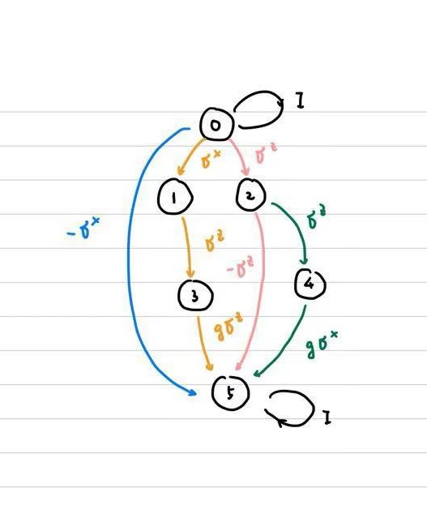

# Note for hw4

**本文件夹包含以下内容：**

- vMpsObc_Heisenberg_191027.py：完成海森堡模型的MPO示例代码（并没有用到）
- Sub180221.py：Sample code，存储需要本题需要调用的大量函数
- note.md：介绍源代码以及主要思路
- variational_MPS.py：完成homework的源代码
- mpo_finite_automaton：第一问的自动机模型图


### Source Code:

源代码使用MPS变分法、精确对角化求解哈密顿量的基态并且计算了X、Z方向上的平均自旋。源代码中各个函数的用途均有注释说明，与课上重复部分在此不再赘述，下面介绍我在本次作业中用到的新的算法的大致思路。

- `OptTSite(Mpo, HL, HR, T, Method=0)`：我的代码中设计了`Method=2`的优化方案——即每次优化两个site，实现方法与Method=0类似，不过最终留下的T是一个矩阵，这是为了方便后续进行SVD分解。
- `OptT_SVD(Mpo, HL, HR, T)`：本函数与`Method=2`的优化方案配套使用。需要注意的是进行SVD分解之后要将`U,V,S`的相应维数修改为原先MPS中bond的维数。
- `MagnetZ(T),MagnetX(T)`：在变分法求出各个site位置上的MPS之后进一步计算平均自旋。我采用的方法是直接将MPS与其conjugate的右侧虚拟指标缩并（因为除开`T[0]`之外的MPS都是canonical form），将MPS与其conjugate的物理指标与$\sigma_x,\sigma_z$缩并。最棘手的是MPS及其conjugate的左侧虚拟指标，因为`T[0]`并不是canonical的，所以我需要用`T_mixterm`来将存储它们左侧的缩并对象。对于site=0的情况，直接将左侧虚拟指标缩并即可，对于site>0的情况，我需要将该site左侧的所有MPS及其conjugate进行缩并，存储在`T_mixterm`中，并且在每次迭代过程中及时update。
- `Get_Hamiltonian(Ns),MagnetZ_ED(V, Ns),MagnetX_ED(V, Ns)`：精确对角化方法构造哈密顿量，计算平均自旋，计算的思路与HW1、HW2类似，在此不再赘述。

### Output


> Q1: write down the MPO for this Hamiltonian, draw a finite automata figure:



> Q2: write a code for the 2-site variational MPS method:

在`Source Code`一节中已有介绍，此处不再赘述。

> Q3&Q4: 对于题给参数$N_s=10,g=0.428$，代码运行结果如下：

> 使用MPS变分法的计算结果为
```
For the case of Ns = 10, Ds = 4, we can get:
===========================2-site optimization===========================
Energy per site: [-1.0281352  -1.0281352  -1.0281352  -1.02814359 -1.0281424  -1.02814466
 -1.0281424  -1.02814359 -1.0281352  -1.0281352 ]
Magnetization in x direction per site: [0.91553612 0.90662653 0.92540262 0.92553329 0.92530986 0.92525536
 0.92543938 0.92519728 0.90646774 0.91535268]
Magnetization in z direction per site: [-2.78547740e-10 -3.13177428e-10 -4.38262315e-10 -3.73766518e-10
 -8.54481819e-10 -4.29058788e-10 -1.31759958e-09 -1.19277871e-09
 -1.53740620e-09 -1.26942756e-09]
===========================1-site optimization===========================
Energy per site: [-1.02813726 -1.02813726 -1.02813726 -1.02813726 -1.02813726 -1.02813726
 -1.02813726 -1.02813726 -1.02813726 -1.02813726]
Magnetization in x direction per site: [0.91552868 0.90662361 0.92549725 0.92572398 0.92546726 0.92546664
 0.92572325 0.92549707 0.90662364 0.91552875]
Magnetization in z direction per site: [ 2.56550004e-07  1.02970786e-07  1.17852897e-06 -3.18156168e-06
  5.52057306e-06 -5.29135670e-06  2.95564343e-06 -1.40550133e-06
 -1.16165052e-07 -3.26805922e-07]

For the case of Ns = 10, Ds = 6, we can get:
===========================2-site optimization===========================
Energy per site: [-1.02816667 -1.02816667 -1.02816667 -1.02816832 -1.02816805 -1.0281689
 -1.02816805 -1.02816832 -1.02816667 -1.02816667]
Magnetization in x direction per site: [0.91529267 0.90635184 0.92494764 0.92500014 0.92482926 0.92482077
 0.92497008 0.92486688 0.90631202 0.91525033]
Magnetization in z direction per site: [-2.60612310e-10 -3.33296724e-10 -3.27015637e-10 -1.29099437e-09
 -5.46134804e-11 -1.39669265e-09 -4.14761503e-10 -2.79136492e-10
 -1.48277751e-09 -6.44511944e-10]
===========================1-site optimization===========================
Energy per site: [-1.02816705 -1.02816705 -1.02816705 -1.02816705 -1.02816705 -1.02816705
 -1.02816705 -1.02816705 -1.02816705 -1.02816705]
Magnetization in x direction per site: [0.91530818 0.90637855 0.92498802 0.92505686 0.92491064 0.92491279
 0.92505872 0.92497888 0.9063697  0.91530455]
Magnetization in z direction per site: [-4.69513861e-06 -5.78136062e-06 -8.20984420e-06 -5.50346132e-06
 -1.02867723e-05 -8.25747238e-06 -4.16518745e-06 -8.66063333e-06
 -5.62602455e-06 -4.64307168e-06]
```
> 使用精确对角化方法的计算结果为：
```
===========================Exact diagonalization===========================
Energy per site: [-1.02817681]
Magnetization in x direction per site: [0.91516497 0.90622903 0.92478495 0.92488639 0.92475944 0.92475944
 0.92488639 0.92478495 0.90622903 0.91516497]
Magnetization in z direction per site: [-3.71230824e-16 -3.50414142e-16 -3.64291930e-16  4.12864187e-16
  7.59808882e-16  1.38430933e-15  3.71230824e-16  2.03656536e-15
  3.15719673e-16  5.93275429e-16]
```

可以发现，$D_s=6$时用MPS变分法求解出的结果更接近于精确对角化的结果，1-site MPS变分法的结果优于2-site MPS变分法。